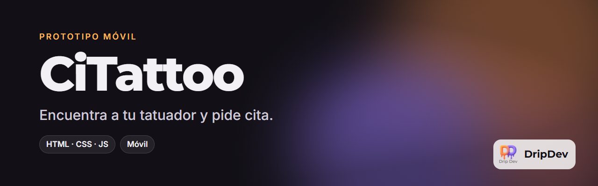

  

  
  
  

**CiTattoo** es el prototipo de una app para encontrar tatuador y pedir cita sin perseguir a nadie por mensajes. Tiene dos caras: la del cliente, que busca inspiración y contacta con el tatuador, y la del profesional, que gestiona su agenda.

<!-- Capturas: añade las imágenes en docs/capturas/ y descomenta esta sección.
## Capturas

  
  
  
  

-->

## Qué puedes hacer

- **Inspirarte** en un muro de tatuajes reales.
- **Conocer a cada tatuador**: su estilo, sus trabajos y su estudio.
- **Escribirle** por mensaje para pedir cita, desde su perfil.
- **Vista profesional** para el tatuador, con su agenda de citas.

## Pruébala

Abre la [demo](https://roblesgg.github.io/CiTattoo/) desde el móvil. Para ver la cara del profesional, pulsa **Soy profesional**.

## Hecho con

Una sola página HTML con CSS y JavaScript, sin framework ni servidor, publicada con GitHub Pages.

## Estado

Prototipo de diseño. Los datos son de ejemplo y todavía no hay reservas reales.

---

   
  Un producto de <b>DripDev</b> · hecho por Álvaro Robles

