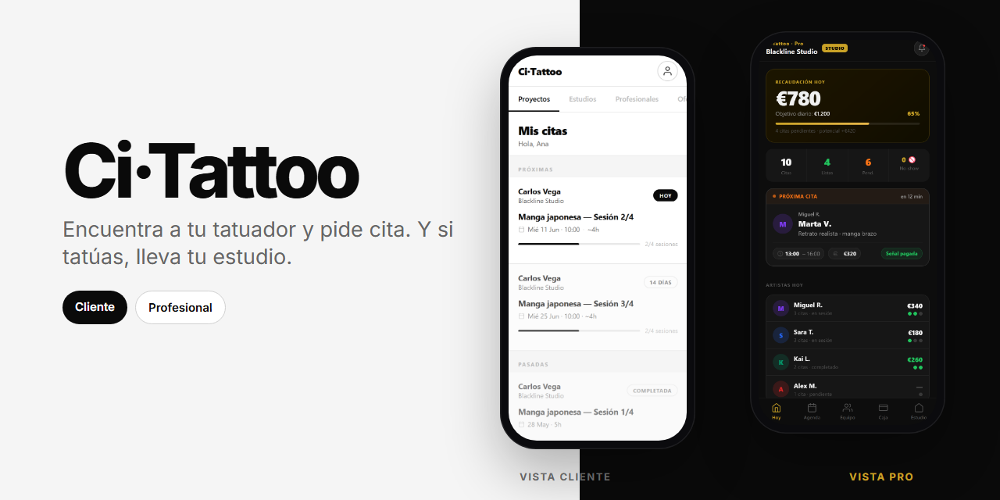
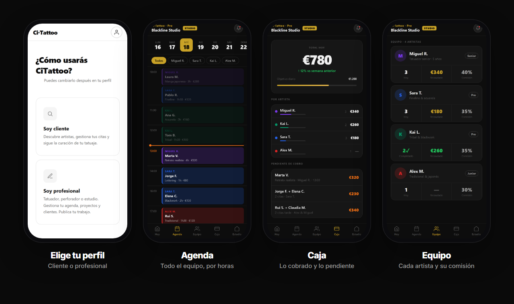

  

  
  
  

**Ci·Tattoo** tiene dos caras.

- **Si quieres tatuarte:** te inspiras, encuentras a tu tatuador, le escribes y sigues tus sesiones.
- **Si tatúas:** llevas el estudio desde el móvil: agenda del equipo, caja y comisiones.

  

## Qué puedes hacer

**🖤 Como cliente**

- **Inspirarte** en un muro de tatuajes y guardar los que te gustan.
- **Conocer a cada tatuador:** su estilo, sus trabajos y su estudio.
- **Escribirle** para pedir cita, desde su perfil.
- **Mis citas:** cada sesión de tu pieza, con su progreso.

**✒️ Como profesional**

- **Hoy:** lo recaudado, la próxima cita y cómo va cada artista.
- **Agenda** del estudio por horas y por artista.
- **Caja:** lo cobrado y lo pendiente de cobro.
- **Equipo:** citas, recaudación y comisión de cada artista.

## Pruébala

Abre la [demo](https://roblesgg.github.io/CiTattoo/) desde el móvil. Al entrar eliges si eres cliente o profesional.

## Hecho con

HTML, CSS y JavaScript en una sola página, sin framework ni servidor, publicada con GitHub Pages.

<b>Estado</b>

 

Prototipo de diseño: los datos son de ejemplo y todavía no hay reservas reales. Las capturas de arriba son de la demo real.

---

Un producto de <a href="https://dripdev.dev"><b>DripDev</b></a> · hecho por Álvaro Robles

